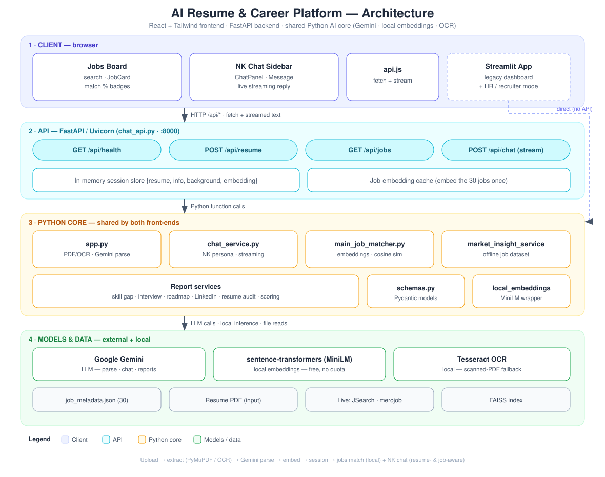
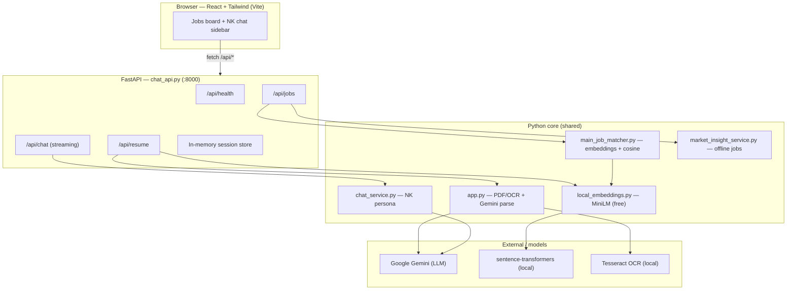
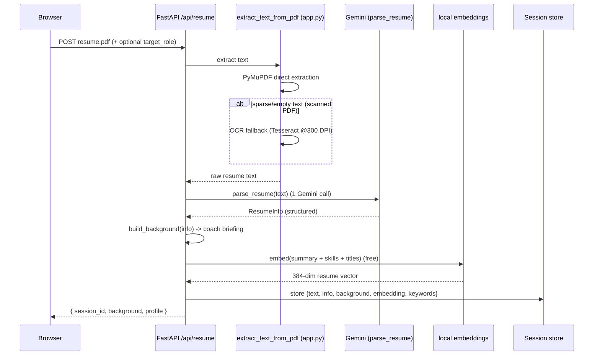

# Developer Guide — AI Resume & Career Platform

A full-stack AI application that ingests a candidate's resume, understands it, and turns it
into useful career help: a skill-gap analysis, job matches, interview prep, a learning roadmap,
and a natural conversational coach (**NK**) that is both resume-aware and job-aware.

This document is written for developers. It explains **how a resume is processed end to end**,
**every part of the stack and what it does**, the **API**, **how to run it**, and a
**roadmap of what can be built next**.

> **What makes it different from other tools?** See [`docs/WHAT_MAKES_IT_UNIQUE.md`](docs/WHAT_MAKES_IT_UNIQUE.md).

---

## 1. What it is

There are two front-ends sharing one Python "brain":

| Surface | Tech | Purpose |
|---|---|---|
| **React app** (`frontend/` + `chat_api.py`) | React + Tailwind + FastAPI | The modern product: a jobs board with resume-match scores and **NK**, a context-aware career copilot in a sidebar. |
| **Streamlit app** (`streamlit_app.py`) | Streamlit (pure Python) | The original/legacy dashboard: candidate report (skill gap, LinkedIn, interview, roadmap, audit) + an HR/recruiter screening mode. Still works. |

Both reuse the same core modules (`app.py`, the `*_service.py` files, the embeddings, the job
dataset). The intelligence lives in Python; the React UI talks to it over a small HTTP API.

---

## 2. Architecture at a glance

A full diagram lives at [`docs/architecture.svg`](docs/architecture.svg) (open in any browser).
Editable source: [`docs/architecture.mmd`](docs/architecture.mmd).





Why this shape? See [§8 Design decisions](#8-design-decisions--why).

---

## 3. Full tech stack

### Frontend
- **React 18** — UI components (`frontend/src`).
- **Vite 5** — dev server (`:5173`) + production bundler. Dev server proxies `/api` → `:8000`.
- **Tailwind CSS v4** — styling, via the `@tailwindcss/vite` plugin (no config file).
- **react-markdown** — renders NK's markdown answers (lists, bold, links).
- **Node.js 24 / npm 11** — toolchain (build/dev only; not needed at runtime once built).

### Backend API
- **FastAPI** — the HTTP layer (`chat_api.py`).
- **Uvicorn** — ASGI server.
- **python-multipart** — handles the resume file upload.
- **Pydantic** — request/response validation + the structured LLM output schemas.

### AI / ML
- **Google Gemini** (via `langchain-google-genai`) — resume parsing, chat, and the report features. Model from `GEMINI_MODEL` env (e.g. `gemini-2.0-flash` / `gemini-2.5-flash-lite`).
- **LangChain** — prompt templates + `PydanticOutputParser` chains (`prompt | llm | parser`).
- **sentence-transformers** — local embeddings (`all-MiniLM-L6-v2`, 384-dim). **Free, offline, no quota.** Used for all semantic matching.
- **scikit-learn** — cosine similarity for match scoring.
- **FAISS** — vector index (present for the job-portal data; `faiss_index_data/`).

### PDF / OCR
- **PyMuPDF (`fitz`)** — fast direct text extraction from PDFs.
- **Tesseract** + **pytesseract** + **Pillow** — OCR fallback for scanned/image PDFs (renders pages at 300 DPI, then OCRs).
- **pdfplumber / pdf2image** — auxiliary PDF tooling.

### Data sources
- **`job_metadata.json`** — 30 real job descriptions used offline (the React jobs board's source). Free, deterministic, no API.
- **JSearch (RapidAPI)** — live US jobs (`job_portal.py`), Streamlit only.
- **merojob.com** — live Nepal jobs (`merojob_client.py`), Streamlit only.

### Legacy UI
- **Streamlit** — the `streamlit_app.py` dashboard + HR mode.

---

## 4. How a resume is processed (end to end)

This is the heart of the system. When a user uploads a PDF to the React app, here is exactly
what happens:



### Step by step

1. **Upload** — `POST /api/resume` (multipart). The file is wrapped in `_UploadShim` so it
   matches the interface the existing extractor expects.

2. **Text extraction** — `extract_text_from_pdf()` (in `app.py`):
   - First tries **PyMuPDF** direct text extraction (fast, works for normal PDFs).
   - If the result is empty/sparse (< 50 chars), it falls back to **OCR**: each page is
     rendered to a 300-DPI image and run through **Tesseract**. This is what lets scanned
     resumes work.
   - Temp files are written to `temp/` and cleaned up (with a Windows file-lock retry loop).

3. **Structured parsing** — `parse_resume(text, llm)`:
   - A **LangChain** chain: `resume_extraction_prompt | Gemini | PydanticOutputParser`.
   - Produces a **`ResumeInfo`** object (Pydantic): `name`, `email`, `phone_number`,
     `linkedin_url`, `job_title`, `summary`, `skills[]`, `work_experience[]`,
     `experience_years`, `education[]`, `optimized_search_keywords[]`.
   - The prompt explicitly instructs the model to **compute total years of experience** and
     generate **search keywords**. This is the only Gemini call in the upload step.

4. **Coach briefing** — `build_background(info)` (in `chat_service.py`) turns the structured
   resume into a short, readable briefing the chatbot uses as context (name, title, years,
   skills, recent roles). It's injected into NK's system prompt so answers are personal.

5. **Resume embedding** — a free local **sentence-transformers** vector is computed from
   `summary + skills + job titles`. This vector is what powers job-match scoring.

6. **Session** — everything (`resume_text`, `info`, `background`, `embedding`, `keywords`) is
   stored in an in-memory dict keyed by a generated `session_id`. The frontend keeps the
   `session_id` and sends it with `/api/jobs` and `/api/chat`, so the resume is never resent.

From here the resume powers three things:
- **Job matching** (§6),
- **The chatbot** (§5),
- **The Streamlit report features** (skill gap, LinkedIn, interview, roadmap, audit).

---

## 5. The chatbot — NK

`chat_service.py` is deliberately the opposite of the rigid, schema'd HR Q&A: it returns
**natural, streamed, plain-text** replies with a warm persona.

- **Persona** — a system prompt (`_SYSTEM_PROMPT`) defines NK as a friendly career coach:
  short replies, conversational, no jargon, never invents facts.
- **Resume-aware** — the `background` briefing (from `build_background`) is embedded in the
  system prompt.
- **Job-aware (copilot mode)** — `format_job_context(job)` adds the job the user is currently
  viewing (title, company, match %, description) so NK can answer "am I a fit for *this* one?"
  by comparing the posting against the resume.
- **Streaming** — `stream_reply()` yields tokens from `llm.stream(...)`; FastAPI sends them as
  chunked `text/plain`, and the React client appends them for a live "typing" effect.
- **Graceful failure** — quota/rate-limit errors become a friendly message, not a stack trace.

---

## 6. Job matching

- **Source** — `job_metadata.json` (30 jobs), loaded/cached by `market_insight_service.load_jobs()`.
- **Search** — `GET /api/jobs?q=...` filters by keyword (`offline_jobs_for_keywords`).
- **Match score** — when a `session_id` is present, each job is embedded once (cached in
  `_JOB_EMB`) and scored against the resume vector with **cosine similarity**
  (`main_job_matcher.calculate_similarity`). Results are sorted best-fit first. All of this is
  **local and free** — no Gemini calls.
- **Live jobs** — the Streamlit app additionally fetches live jobs (JSearch for US, merojob for
  Nepal) and runs a heavier per-job LLM analysis (experience requirements, categorization).
  This is **not** wired into the React page yet (quota/cost) — see the roadmap.

---

## 7. API reference

Base URL (dev): `http://localhost:8000`

### `GET /api/health`
Returns status, the active model, and how many offline jobs are loaded.
```json
{ "status": "ok", "assistant": "NK", "model": "gemini-2.5-flash-lite", "jobs_available": 30 }
```

### `POST /api/resume`  (multipart)
Fields: `file` (PDF, required), `target_role` (string, optional).
```json
{
  "ok": true,
  "session_id": "…",
  "background": "Background on the person… (briefing)",
  "profile": { "name": "…", "job_title": "…", "experience_years": 2, "skills": ["…"] }
}
```
On failure: `{ "ok": false, "error": "…" }` (e.g. unreadable scan, parse failure).

### `GET /api/jobs`
Query: `session_id` (optional), `q` (optional keywords), `limit` (default 30).
```json
{
  "ok": true, "count": 30, "has_resume": true,
  "jobs": [
    { "id": "…", "title": "…", "company": null, "location": null,
      "is_remote": false, "url": null, "description": "…", "match_score": 0.805 }
  ]
}
```
`match_score` is `null` until a resume session exists; otherwise 0–1 and the list is sorted.

### `POST /api/chat`  (streaming `text/plain`)
```json
{
  "messages": [{ "role": "user", "content": "Am I a good fit for this role?" }],
  "session_id": "…",            // pulls resume background server-side
  "job_context": { "title": "…", "company": "…", "match_score": 0.8, "description": "…" }
}
```
Response is a stream of UTF-8 text chunks (NK's reply, token by token).

---

## 8. Design decisions & why

- **Python core + thin API + JS frontend.** The ML libraries (sentence-transformers, PyMuPDF,
  Tesseract, LangChain) are Python-only. Rather than rewrite them, we expose them via FastAPI
  and build a polished React UI on top — the standard production shape.
- **Local embeddings for matching.** Semantic search/match scoring uses a local MiniLM model →
  **free, offline, unlimited**. Gemini is reserved for the few places that truly need a
  generative LLM (resume parse, chat, report writing).
- **Quota-conscious / lazy LLM.** Gemini free tier rate-limits hard. The app makes **one**
  Gemini call on upload (the parse) and otherwise only calls the LLM on explicit user actions.
- **In-memory sessions.** Simple and fast for a single-process demo. (Swap for Redis/DB to go
  multi-worker — see roadmap.)
- **Streaming chat.** Makes the assistant feel human and responsive.

---

## 9. Project structure

```
D:\resume 2\
├── app.py                     # PDF extraction + OCR, Gemini model init, parse_resume, ResumeInfo
├── chat_service.py            # NK persona, build_background, format_job_context, stream_reply
├── chat_api.py                # FastAPI: /api/health /api/resume /api/jobs /api/chat + sessions
├── streamlit_app.py           # Legacy Streamlit dashboard (candidate) + HR mode entry
├── schemas.py                 # Pydantic schemas for all report objects
├── local_embeddings.py        # sentence-transformers wrapper (embed_documents/embed_query)
├── main_job_matcher.py        # generate_embedding, calculate_similarity, process_jobs (live)
├── market_insight_service.py  # offline job dataset: load_jobs, search, top skills per role
├── skill_gap_service.py       # matched/missing/recommended skills + match %
├── linkedin_service.py        # LinkedIn headline/About/keyword rewrites (LLM)
├── interview_service.py       # likely interview questions (LLM)
├── roadmap_service.py         # 30/60/90-day learning plan (LLM)
├── resume_feedback_service.py # ATS heuristic + LLM resume audit
├── scoring_service.py         # weighted overall readiness score
├── hr_service.py / hr_ui.py   # HR/recruiter screening + grounded candidate chat (Streamlit)
├── scan_ui.py                 # animated "scanner" UI for the upload step (Streamlit)
├── job_metadata.json          # 30 offline jobs
├── requirements.txt
└── frontend\                  # React + Vite + Tailwind app
    ├── index.html
    ├── package.json
    ├── vite.config.js         # proxies /api -> :8000
    └── src\
        ├── main.jsx
        ├── App.jsx            # state + two-pane layout (jobs board + NK sidebar)
        ├── api.js             # fetch helpers: uploadResume, fetchJobs, streamChat
        ├── index.css          # Tailwind entry
        └── components\
            ├── JobCard.jsx
            ├── ChatPanel.jsx
            └── Message.jsx
```

---

## 10. Running it

### React app (recommended)
**Use it (built UI served by the backend — no Node needed at runtime):**
```cmd
cd "D:\resume 2"
venv\Scripts\activate.bat
python -m uvicorn chat_api:app --port 8000
```
Open **http://localhost:8000**.

**Dev mode (live reload, two terminals):**
```cmd
:: terminal 1 — backend
python -m uvicorn chat_api:app --reload --port 8000
:: terminal 2 — frontend (fresh terminal so Node is on PATH)
cd "D:\resume 2\frontend"
npm install      # first time only
npm run dev      # http://localhost:5173
```
Rebuild the served UI after editing the frontend: `npm run build`.

### Streamlit app (legacy dashboard + HR mode)
```cmd
cd "D:\resume 2"
venv\Scripts\activate.bat
streamlit run streamlit_app.py
```

### Environment (`.env`)
```
GEMINI_API_KEY=…            # required
GEMINI_MODEL=…              # e.g. gemini-2.0-flash / gemini-2.5-flash-lite
EMBEDDING_BACKEND=local     # local (default, free) or google
LOCAL_EMBEDDING_MODEL=sentence-transformers/all-MiniLM-L6-v2
JSEARCH_RAPIDAPI_KEY=…      # only for live US jobs (Streamlit)
```
> Tesseract must be installed for OCR on scanned PDFs (see the note in `app.py`).

---

## 11. Known limitations

- **Free-tier Gemini quota** — heavy use hits 429s; the app degrades gracefully but the user must wait.
- **In-memory sessions** — lost on restart; won't work across multiple worker processes.
- **React jobs board uses the 30-job offline dataset only** — live jobs remain in Streamlit.
- **No authentication** and **no persistence** (resumes/sessions aren't stored to disk/DB).
- **PII handling is not yet production-grade** — resumes are processed in memory but there's no consent flow or formal data policy.

---

## 12. Roadmap — what can be built next

### Product features
- **Per-job actions**: "Tailor my resume to this posting" and "Generate a cover letter" as
  downloadable files (DOCX/PDF) — the `python-docx` dependency is already present.
- **Live jobs in React**: wire JSearch (US) + merojob (Nepal) into `/api/jobs` with the same
  match scoring; add a market toggle.
- **Bring the report tabs to React**: skill gap, interview prep, roadmap, resume audit, and the
  weighted readiness score already exist as services — expose them as endpoints + UI.
- **Saved jobs / shortlist** and application tracking.

### Human-feel upgrades
- **Voice in/out** (speech-to-text + TTS) for NK.
- **Quick-action buttons inside replies** (Tailor resume · Save job · Draft cover letter).
- **Follow-up suggestion chips** after each answer.
- **Proactive nudges** ("no cloud skills detected — want a 30-day plan?").

### Production / "first-world" hardening
- **Privacy & consent**: explicit "your resume isn't stored / is deleted after your session"
  notice + consent checkbox; document a data policy (GDPR-style).
- **Accessibility (WCAG)**: keyboard nav, ARIA labels, contrast, screen-reader support.
- **Security**: file size/type limits, rate limiting, no secrets in the client, HTTPS in prod.
- **Internationalization**: English / Nepali toggle (the project already targets both markets).

### Engineering / scale
- **Persistence**: move sessions to Redis and resumes/results to a database (Postgres).
- **Auth & accounts** so users keep history across visits.
- **RAG for long resumes**: chunk + retrieve instead of passing the whole text to the LLM.
- **Caching & cost controls**: cache parses/embeddings; add a model-tier fallback.
- **Tests + CI**: unit tests for the pipeline, contract tests for the API, a CI build.
- **Deployment**: containerize (Docker), serve the built frontend from FastAPI (already
  supported via `frontend/dist`), and add observability/logging.

---

*Generated as developer documentation for the AI Resume & Career Platform (`D:\resume 2`).*
